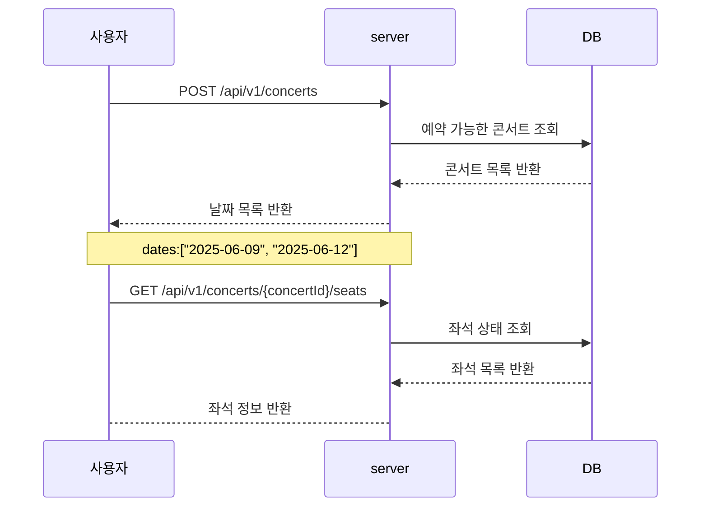
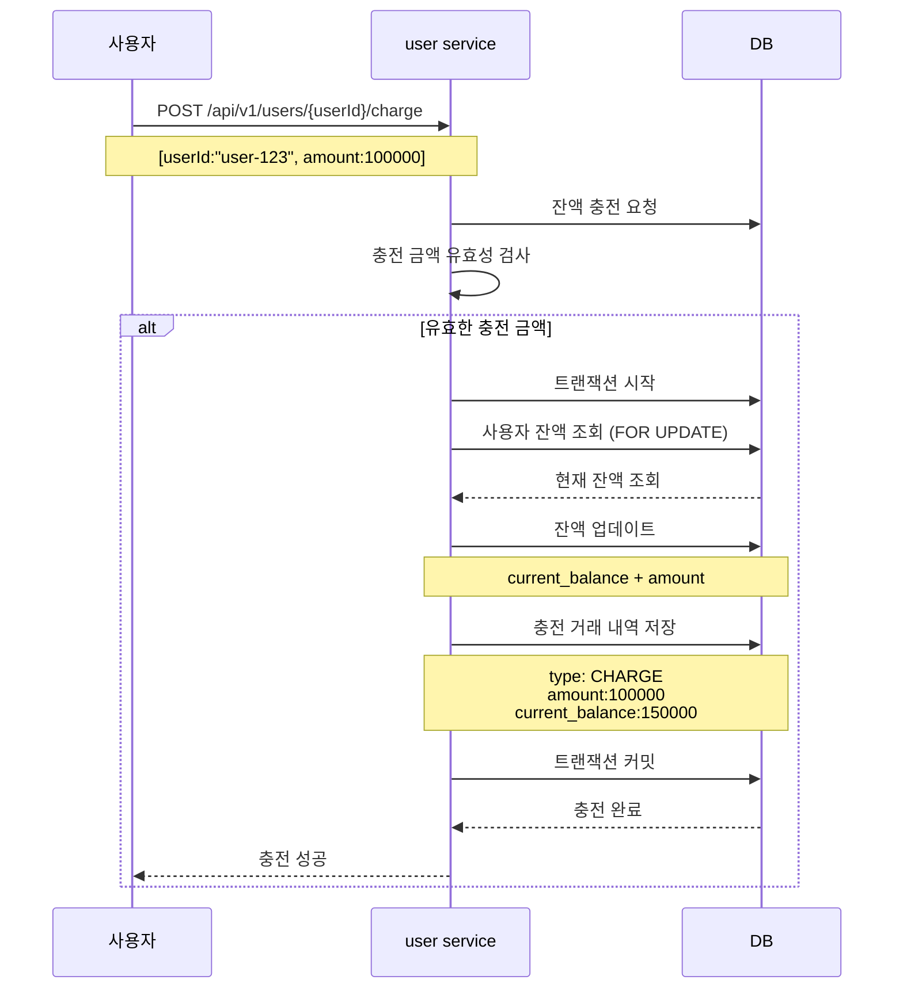
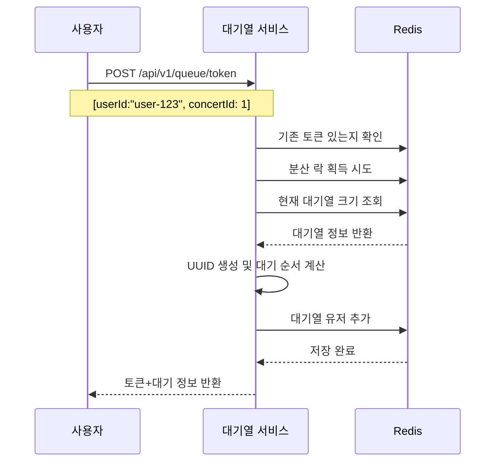
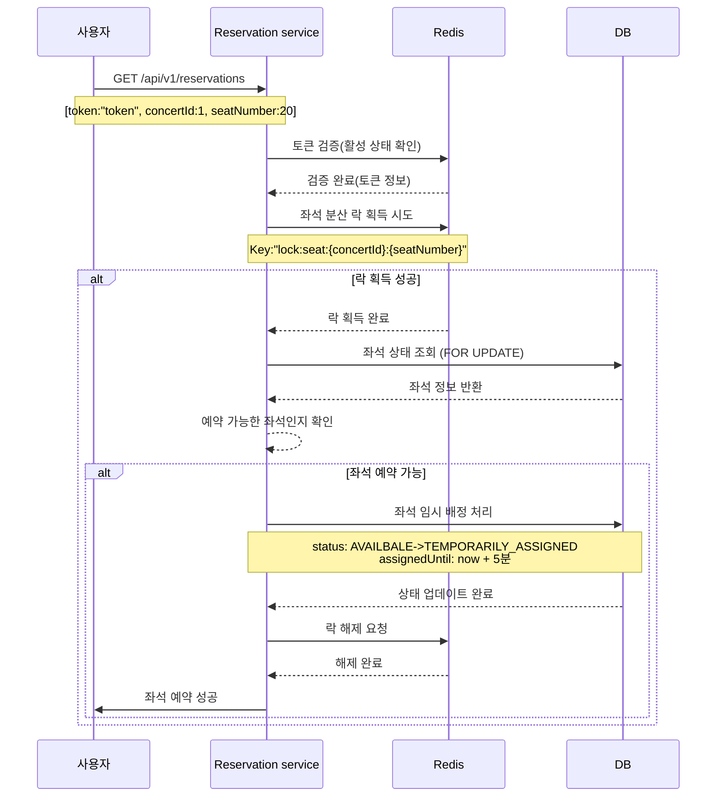
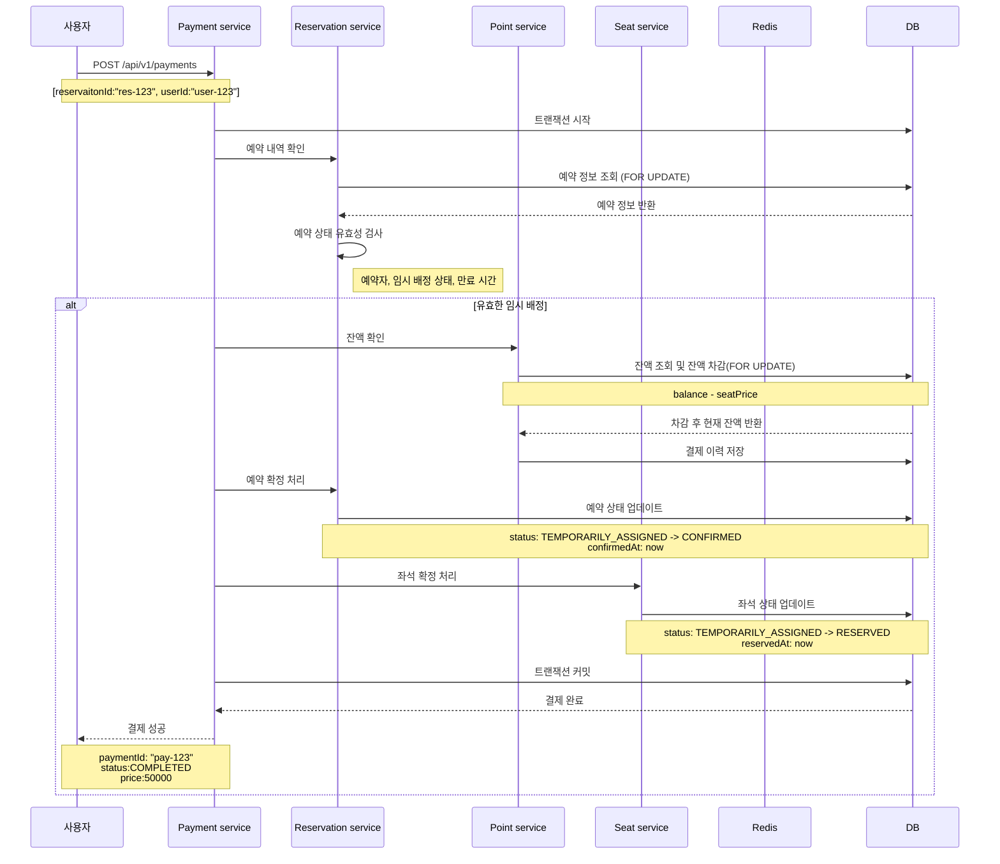

## 시퀀스 다이어그램(Sequence Diagrams)
## 개요
콘서트 예약 서비스의 주요 API 플로우를 시각화한 시퀀스 다이어그램입니다. 각 다이어그램은 사용자와 시스템 간의 상호작용을 시간 순서대로 보여줍니다.

## 1. 콘서트 정보 조회 및 좌석 정보 조회 플로우
예약 가능한 날짜와 좌석 정보를 조회하는 과정 (대기열 토큰 필요X)

## 2. 잔액 충전 플로우
사용자가 결제를 위해 잔액을 충전하는 과정

## 3. 대기열 토큰 발급 플로우
사용자가 서비스 이용을 위해 대기열 토큰을 발급받는 과정

## 4. 좌석 예약 요청 플로우
사용자가 좌석을 선택하고 임시 배정을 받는 과정 (대기열 토큰 필요O)

## 5. 결제 처리 플로우
임시 배정된 좌석에 대해 결제를 완료하는 과정 (대기열 토큰 필요O)

