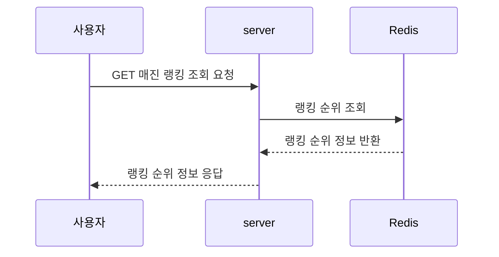
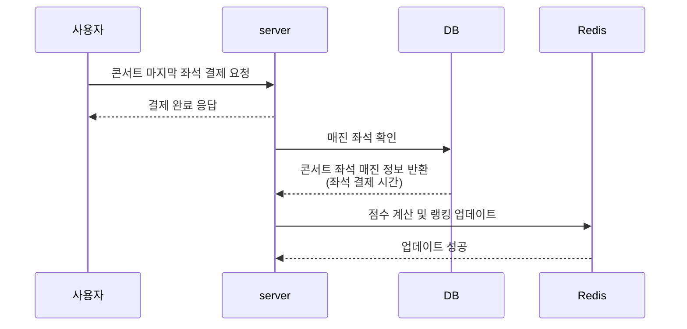

# 콘서트 매진 랭킹 설계 보고서
## 1️⃣ 랭킹 산정 기준
### 좌석 상태
- 좌석 상태가 `RESERVED` 인 경우를 기준으로 산정 (결제로 예약 완료 상태)
- `TEMPORARILY_ASSIGNED` 상태일 경우는 최종 결제까지 이뤄지지 않으면 만료되기 때문에 기준으로 적합하지 않다고 판단
### 점수 산정
- |티켓 오픈 시간 - 마지막 좌석 결제 시간|
- 시간이 동일한 경우 → 티켓 오픈 시간이 먼저인 것을 우선 순위로 결정
- 좌석 수가 다른 경우가 있으므로 `남은 좌석 수에 가중치 부여`

## 2️⃣ 구현 방식
### Redis 기반
- Redis의 Sorted Set 자료구조를 이용하여 구현
  `ZADD ranking:weekly {score} {concertId}`
- 일간 랭킹으로 구현(일주일 후 만료)
### 점수 계산 방식
- 이전 공식
```
매진 속도 점수 = (전체 좌석 수) / (매진까지 걸린 시간 초)
-> 시간 당 몇 좌석이 팔렸는지 
```

- 개선된 공식
```
점수 = 매진 시간(초) + (100000 - 좌석 수) + 오픈 시간 timestamp (초)
        ↑                      ↑                     ↑
      빠를수록↓          좌석 많을수록↓           빠를수록↓
```
  - 100000 는 좌석 수 보정을 위한 임의 값 (서비스 기준으로 더 대형 콘서트가 있으면 키우기)
  - 전체 점수를 더하고 Long 타입으로 Redis Sorted Set 에 저장
  - 좌석 수가 많고, 매진이 빠르고, 오픈이 빠를수록 => 낮은 점수 (높은 순위)

#### 왜 개선을 했는가?
-> 처음 방식을 사용하면 Redis Sorted Set 에 넣기 위해서 부동 소수(double) 정렬을 정밀하게 사용해야하고, 속도가 동일한 경우 정렬이 어려움 (오픈 시점 보장)
### 랭킹 갱신 방식
1. 좌석 결제 시 이벤트 발행
   - 비동기 처리 & 실시간 가능
   - 판매 가능한 좌석이 0이 되면 event 처리하도록 구성
2. 스케줄러 사용
   - 매일 or 시간별 스케줄러 동작
   - 실시간성 부족

**=> 결제 시 이벤트 발행 선택**
**선택한 이유**
- 실시간 반영 가능 (좌석이 모두 RESERVED 되자마자 랭킹 갱신)
- 이벤트 기반 구조는 이후 kafka 등 확장성이 좋음
(스케줄러는 모든 콘서트를 반복 스캔해야 하니까 리소스 낭비 우려가 있다고 판단)

**=> 추후 스케줄러로 변경 예정**
- 매진 랭킹은 실시간성 보다 정확성이 중요하다 생각해 추후 변경 예정

## 3️⃣ 랭킹 데이터 관리
- **Redis** 와 **DB** 사용
- Redis : 상위 20~50위만 유지 (캐싱 목적)
- DB : 전체 매진 콘서트 랭킹 (히스토리/백업/추이 분석용)
- 매번 DB에 접근하지 않고 빠르게 조회할 수 있도록 Redis에 캐시로 저장
- 서버 재시작, 메모리 초과, TTL 등으로 데이터 유실 가능성 있으므로 DB에 데이터 저장

## 4️⃣ 플로우 정리
### 매진 랭킹 조회 플로우


### 매진 랭킹 업데이트 플로우

