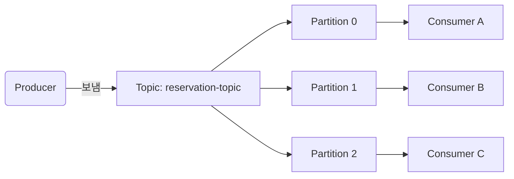
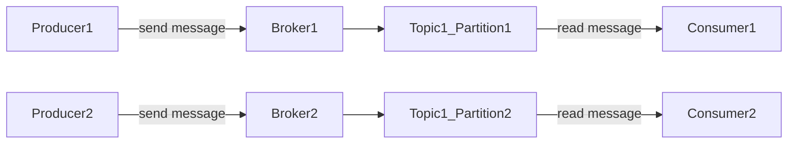
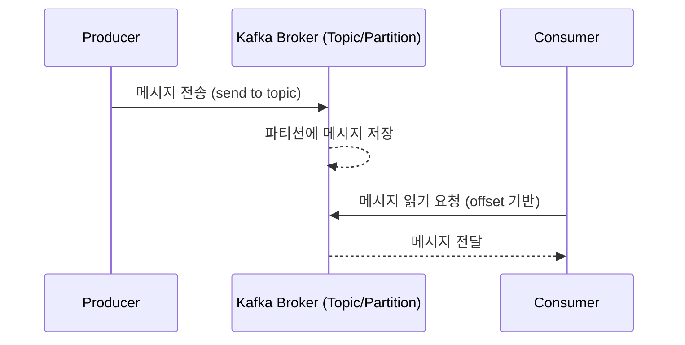
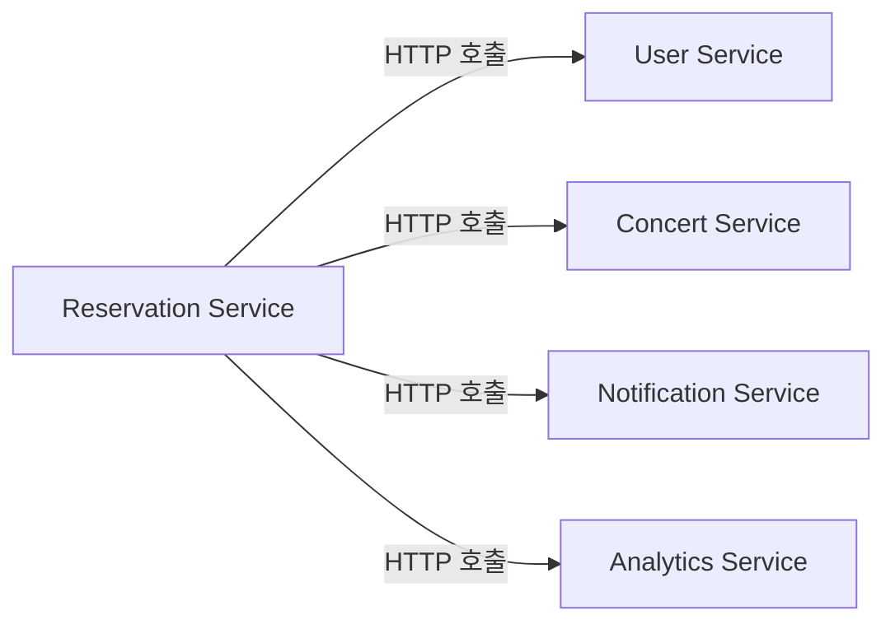
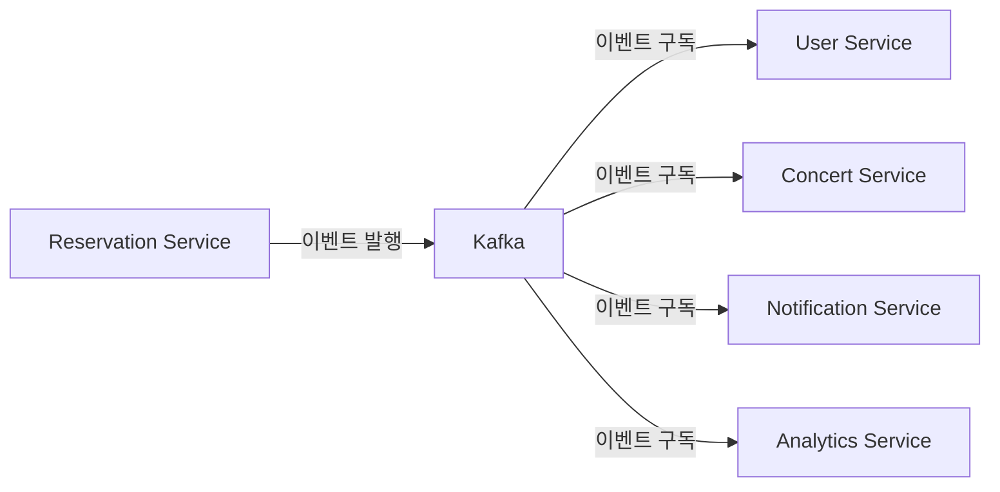

# Apache Kafka 기초 개념
## 1. kafka 란?
### 1-1. 정의
Kafka는 대용량 실시간 데이터 스트리밍을 처리하기 위한 **분산 메시징 시스템**이다. 한쪽에서 보낸 데이터를 다른 쪽에서 비동기적으로 받아볼 수 있도록 중간에서 전달해준다.

**=> 왜 kafka가 필요할까?**
데이터를 직접 주고 받는 구조에서는 **시스템 간 결합도**가 높고 **장애 전파** 가능성이 크다. 이를 중간에서 완충하며 **비동기 처리, 내결함성, 유지보수성**을 제공한다.

### 1-2. 특징
- 실시간 스트리밍 처리
- 높은 처리량과 확장성
- 메시지 영속성 (메시지를 파일처럼 저장)
- 분산 구조 (장애에 강하고, 서버를 쉽게 추가할 수 있음)

### 1-3. 대표 사용 사례
- 실시간 로그 수집 및 분석 (e.g. ELK Stack + kafka)
- 마이크로서비스 간 이벤트 전달
- 실시간 모니터링 및 알림 시스템

## 2. kafka 핵심 개념
### 2-1. 주요 구성 요소
#### 🔹Producer (프로듀서)
- 메세지 생성 및 전송
- 어떤 파티션에 메시지를 보낼지 결
```java
@Service
@RequiredArgsConstructor
public class KafkaMessageProducer {

    private final KafkaTemplate<String, String> kafkaTemplate;

    public void sendMessage(String topic, String message) {
        kafkaTemplate.send(topic, message);
        System.out.println("메시지 전송: " + message);
    }
}
```

#### 🔹Consumer (컨슈머)
- 메시지 수신 및 처리
- 파티션 별로 offset을 유지해 처리했던 메시지 위치 추적
```java
@Component
public class KafkaMessageConsumer {

    @KafkaListener(topics = "reservation-topic", groupId = "notification-service")
    public void listen(String message) {
        System.out.println("받은 메시지: " + message);
    }
}
```

#### 🔹Topic (토픽)
- 메시지가 저장되는 논리적 채널 (카테고리별 메시지 분류)
- partition(파티션) 으로 구성되어 있음

#### 🔹Partiton (파티션)
- Topic(토픽)의 물리적 분할
- 병렬 처리와 확장성을 위해 사용
- 같은 파티션내에서 순서가 보장됨
- 파티션과 컨슈머는 1:1로 매칭


#### 🔹Broker (브로커)
- kafka 서버 인스턴스
- 메시지 저장 및 전달
- 여러 브로커가 클러스 구

### 2-2. 구조도


## 3. kafka 작동 원리
1. Producer가 특정 Topic에 메시지 전송
2. 메시지는 Partition에 분산 저장
3. Consumer는 메시지를 읽고 처리
4. Offset 기반으로 메시지 읽기 위치 추적


## 4. kafka 장단점
### 4-1. 장점
- **높은 성능**
  - 높은 처리량 & 낮은 지연시간
- **확장성**
  - 수평적 확장 (Broker/Partition 추가)
  - Consumer Group을 통한 병렬 처리
- **내구성 및 안정성**
  - 디스크 영구 저장으로 데이터 손실 방지
  - 복제(Replication)을 통한 고가용성
- **유연성**
  - 느슨한 결합 (Producer와 Consumer 간 독립성) 

### 4-2. 단점
- **복잡성**
  - 학습 곡선 높음
  - 설정 및 튜닝 복잡
- **저장소 요구사항**
  - 디스크 공간 많이 필요 & 메모리 사용량 높음
  - 로그 관리 필요
- **네트워크 의존성**
  - 네트워크 지연 영향
  - 브로커 간 통신 오버헤드
  - Zookeeper 의존성
- **기술적 제약**
  - 순서 보장 한계 (Partition 간 순서 보장 불가)
  - 메시지 크기 (기본 1MB 제한)
- **운영 복잡도**
  - 클러스터 관리 복잡
  - 모니터링 필수 & 비용 추가
  - 백업/복구 전략 필요

## 5. 이벤트 기반 시스템으로의 확장
기존의 동기식 요청-응답 방식에서 벗어나 **이벤트 기반 아키텍처**로 전환하면 시스템 전체의 관점에서 많은 이점을 얻을 수 있다.

** 기존 방식의 한계**
- 서비스 간 강한 결합도
- 확장성 제약
- 장애 전파 위험
- 실시간 처리의 어려움


** 이벤트 기반 방식의 장점**
- 느슨한 결합
- 독립적인 확장 가능
- 장애 격리
- 실시간 데이터 처리


## 6. 도입 시 고려 사항
### 6-1. 기술적 고려사항

| 고려사항 | 세부 내용 | 해결 방안 |
|----------|-----------|-----------|
| **메시지 순서** | Partition 간 순서 보장 불가 | 비즈니스 로직에서 처리 |
| **중복 처리** | At least once 전달로 인한 중복 | 멱등성 보장 설계 |
| **데이터 일관성** | 분산 환경에서의 일관성 | Saga 패턴 등 활용 |
| **모니터링** | 분산 환경 모니터링 | Prometheus, Grafana 등 |

### 6-2. 운영적 고려사항

| 영역 | 고려사항 | 대응 방안 |
|------|----------|-----------|
| **인프라** | 클러스터 크기 및 구성 | 부하 테스트 기반 설계 |
| **보안** | 데이터 암호화 및 인증 | SSL/TLS, SASL 설정 |
| **백업** | 데이터 백업 및 복구 | 정기적 백업 및 복구 테스트 |
| **모니터링** | 성능 및 상태 모니터링 | 종합적 모니터링 체계 |
